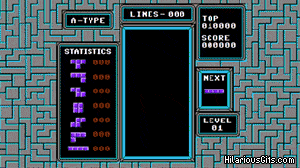

- title : Programação Funcional e Javascript
- description : Diminuindo a Dor de Cabeça no Frontend
- author : Lucas Reis
- theme : night
- transition : slide

***

# Functional Javascript
### Diminuindo a Dor de Cabeça no Frontend

***

### O que você pensa quando pensa em 100 mil linhas de Javascript?

***


***

Vamos começar a atacar essa complexidade num dos níveis mais fundamentais da programação:

### Function Design

***

## Existem apenas dois tipos de inputs e outputs para qualquer função

***

Primeiro tipo:
## Traditional

```js
const sum = (n, m) => n + m
```

Parâmetros são o *input* e o retorno é o *output* da função.

E só.

***

Segundo tipo:
## Hidden

```js
function processNext() {
  let msg = InboxQueue.getNext()

  transformMessage(msg);

  let response;

  if (msg.type === 'TYPE_A') {
    response = axios(url, { params: msg })
  } else {
    let params = { some: 'parameter' }
    response = axios(url, { params })
  }

  response.then(() => processed = true)
}
```

***


***

### Vamos refatorar!

***

Conclusão:

## Programação funcional torna sua vida mais simples!

***



***
